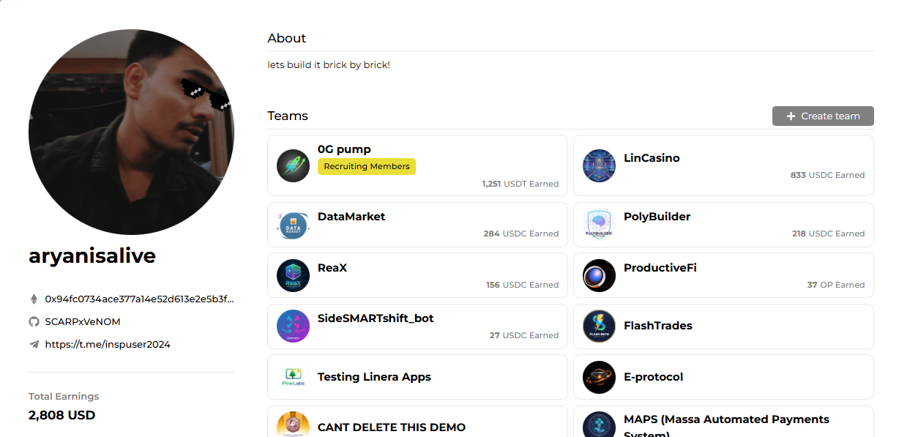

## Hello World! , I'm Aryan Anand [](https://portfolio-aaryan-0713.vercel.app/)

Learning Full-Stack & Blockchain Development | Building on Solana

Currently studying AI/ML at BMSIT and actively participating in Web3 hackathons. Focused on creating decentralized applications that solve real problems.

### Quick Overview

```typescript
const profile = {
  location: "India",
  education: "B.Tech AI/ML @ BMSIT (2024-2028)",
  focus: ["Solana Development", "Full-Stack Web3", "Smart Contracts"],
  Aim to learning: ["ML Specialization (Andrew Ng)", "School of Solana S7"],
  buildathonEarnings: "$1,957 USD"
};
```

---

## Learning Technical Skills

**Blockchain & Web3**  
Solana, Anchor, Ethereum, Solidity, Hardhat, Web3.js, Ethers.js

**Languages**  
TypeScript, Rust, JavaScript, Python, Solidity

**Frontend**  
React, Next.js, TailwindCSS, Shadcn/ui

**Backend & Databases**  
Node.js, Express, PostgreSQL, MongoDB, Prisma, Supabase

---

## Featured Projects

### OG-Pump
**Winner - Akindo Wavehack Buildathon | $1,251 USDT**

Decentralized meme token trading platform built on 0G Tech Stack. Implemented token creation tools, trading infrastructure with real-time price feeds, and multi-chain support.

**Tech Stack:** TypeScript, Solidity, React, Next.js, Web3.js  
**Repository:** [github.com/SCARPxVeNOM/0gpumP](https://github.com/SCARPxVeNOM/0gpumP)


---

### ReaX
**Top 10 Winner - Akindo Wavehack Buildathon | $156 USDC**

Platform enabling users to react to market movements before they happen. Built entirely on Solana using Anchor framework with real-time WebSocket integration.

**Tech Stack:** Anchor, Rust, Solana, TypeScript, Next.js


---

### Election Fund Collector
**CODE RED' 25 Hackathon | BMSIT**

Decentralized fund collection system for election campaigns ensuring transparency through blockchain verification. Deployed smart contracts for immutable transaction records.

**Tech Stack:** Next.js, Supabase, Shadcn/ui, TypeScript, Solidity  
**Date:** January 2025

---

### Additional Projects

| Project | Description | Earnings |
|---------|-------------|----------|
| **DataMarket** | Market data aggregation platform | $284 USDC |
| **PolyBuilder** | Development tools for Polygon | $201 USDC |
| **ProductiveFi** | DeFi productivity suite | $37 OP |
| **SafeBill** | Secure payment system | Active |



---

## GitHub Contributions

<div align="center">

### 📊 Contribution Stats


### 📈 Activity Graph


### 💻 Language Distribution


## Buildathon Summary

| Event | Project | Result | Earnings |
|-------|---------|--------|----------|
| Akindo Wavehack | OG-Pump | Winner | $1,251 USDT |
| Akindo Wavehack | ReaX | Top 10 | $156 USDC |
| Multiple Events | DataMarket | Winner | $284 USDC |
| Multiple Events | PolyBuilder | Winner | $201 USDC |
| Multiple Events | ProductiveFi | Winner | $37 OP |
| CODE RED '25 | Election Fund Collector | Completed | - |

**Total Earnings:** $1,957 USD

---

## Connect

[](https://portfolio-aaryan-0713.vercel.app/)
[](https://github.com/SCARPxVeNOM)
[](https://x.com/aaryan0713)
[](https://t.me/inspuser2024)

---

<div align="center">


**lets build it brick by brick**

</div>
