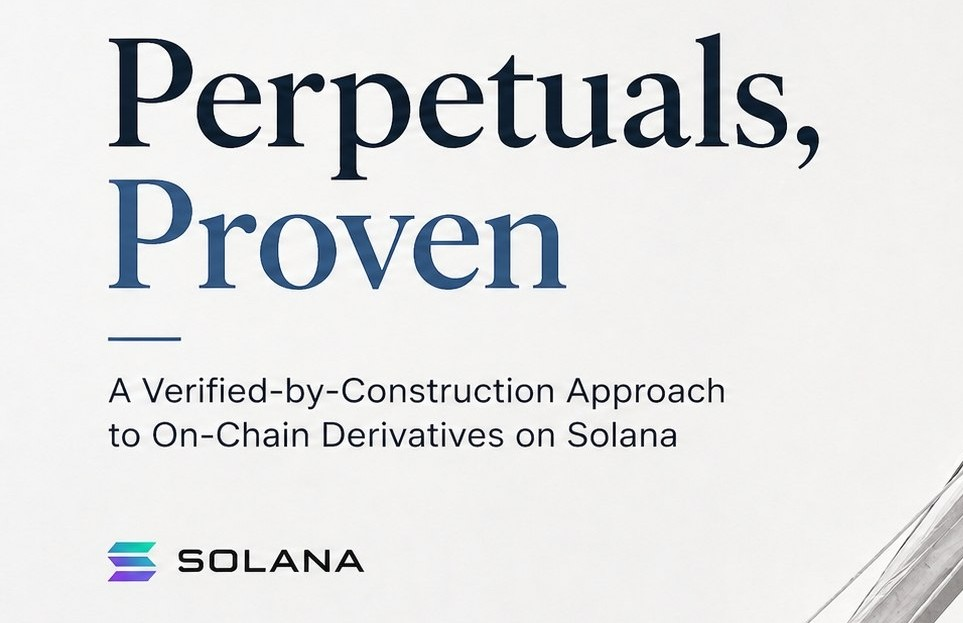
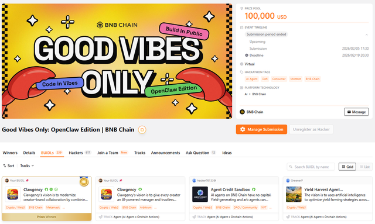
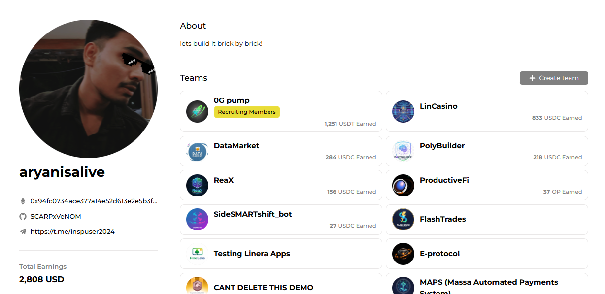
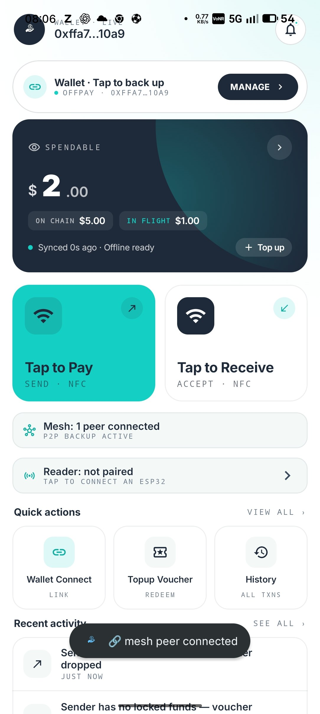
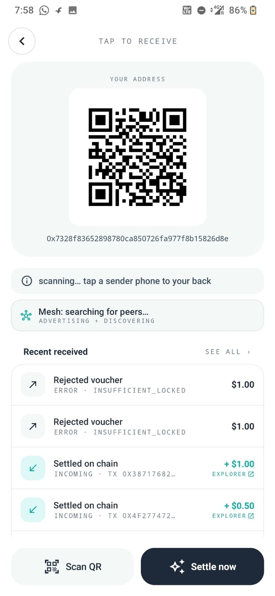
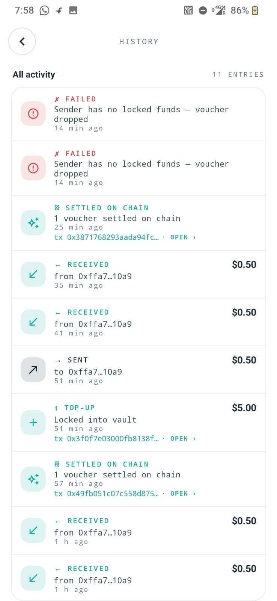

# Aryan Anand

**Full-Stack & Blockchain Engineer**

Building production systems on Solana, EVM chains, and embedded hardware.  
B.Tech AI/ML @ BMSIT (2024–2028) · Bengaluru, India

---

### What I Do

I build end-to-end products — from Solana programs and EVM smart contracts to Android apps with NFC/BLE, ESP32 firmware, and full-stack web dashboards. My work focuses on systems that solve real problems: offline payments that settle deterministically, formally verified DeFi protocols, and AI-powered platforms that have shipped to production.

**$12,000+ earned across hackathons and buildathons.**

---

### Tech Stack

| Domain | Technologies |
|--------|-------------|
| **Blockchain** | Solana, Anchor, Rust, Solidity, Hardhat, Polygon, BNB Chain |
| **Frontend** | React, Next.js, TypeScript, TailwindCSS, Shadcn/ui |
| **Backend** | Node.js, Express, FastAPI, Python, PostgreSQL, MongoDB, Prisma, Supabase |
| **Mobile & Embedded** | Kotlin, Jetpack Compose, C++ (ESP32), NFC, BLE Mesh |
| **Verification** | Lean 4, Proptest, Kani BMC |

---

## Featured Projects

<table>
<tr>
<td width="50%">

### IDLExchange
**Formally verified perpetual futures on Solana**

Four novel DeFi primitives — self-repaying perpetuals, power perpetuals (squeeth), portfolio margining, and gradual deleveraging. 18 machine-checked Lean 4 proofs, MEV-resistant batch auctions, 132 KB on-chain binary with no Anchor runtime.

`Rust` `Solana` `TypeScript` `React` `Lean 4`

[Website](https://idlexchange.online) · [Source](https://github.com/SCARPxVeNOM/atmoic) · [Demo](https://youtu.be/SIK8AdwMVOg)

</td>
<td width="50%">

### Clawgency
**Winner — BNB Chain Hackathon · $10,000 USDT**

AI-powered on-chain influencer agency with milestone-based escrow contracts, role-based dashboards, and governed AI agent workflows. Selected from ~300 submissions and 600 participants.

`Next.js` `TypeScript` `Solidity` `BNB Chain` `OpenClaw`

[Website](https://clawgency.vercel.app) · [Source](https://github.com/SCARPxVeNOM/clawgency) · [Demo](https://youtu.be/14mQVklPPyQ)

</td>
</tr>
<tr>
<td width="50%">

### OFFPAY
**NMIT Hacks 2026 Finals · National Level**

Crypto payments that work when everyone is offline. Signed vouchers with cryptographically bound recipients, NFC tap payments, BLE mesh relay settlement, and ESP32 merchant terminals as stateless trust anchors. 39+ on-chain settlements on Polygon Amoy.

`Solidity` `Kotlin` `Jetpack Compose` `C++` `Node.js` `Polygon`

[Source](https://github.com/SCARPxVeNOM/offline-pay) · [Demo](https://youtu.be/j5fesI0yR4g)

</td>
<td width="50%">

### OG-Pump
**Winner — Akindo Wavehack Buildathon · $1,251 USDT**

Decentralized meme token trading platform on 0G Tech Stack. Token creation tools, trading infrastructure with real-time price feeds, and multi-chain support.

`TypeScript` `Solidity` `React` `Next.js` `Web3.js`

[Source](https://github.com/SCARPxVeNOM/0gpumP)

</td>
</tr>
</table>

<strong>More Projects</strong>

| Project | Description | Tech | Links |
|---------|-------------|------|-------|
| **SafeBill** | Warranty locker with RAG-powered Q&A, OCR extraction, and GST compliance | Next.js, FastAPI, PostgreSQL, AWS | [Website](https://safebill.space) · [Source](https://github.com/SCARPxVeNOM/SAFE) |
| **ReaX** | React to market movements before they happen — built on Solana/Anchor | Anchor, Rust, Solana, TypeScript | [Source](https://github.com/SCARPxVeNOM/ReaX) |
| **DataMarket** | Market data aggregation platform | — | $284 USDC |
| **PolyBuilder** | Development tools for Polygon | — | $201 USDC |
| **ProductiveFi** | DeFi productivity suite | — | $37 OP |

---

## Hackathon Track Record

| Event | Project | Result | Prize |
|:------|:--------|:------:|------:|
| BNB Chain — Good Vibes Only | Clawgency | **Winner** | $10,000 |
| Akindo Wavehack | OG-Pump | **Winner** | $1,251 |
| NMIT Hacks 2026 | OFFPAY | **Finals** | — |
| Akindo Wavehack | ReaX | **Top 10** | $156 |
| Multiple Buildathons | DataMarket, PolyBuilder, ProductiveFi | **Winner** | $522 |
| CODE RED '25 | Election Fund Collector | Completed | — |

**Total: $12,000+ USD**

---

<strong>Gallery</strong>

<table>
<tr>
<td align="center" width="50%">
<strong>IDLExchange — Perpetuals on Solana</strong>  

</td>
<td align="center" width="50%">
<strong>Clawgency — BNB Chain Hackathon Winner</strong>  

</td>
</tr>
<tr>
<td align="center" width="50%">
<strong>OG-Pump — Akindo Buildathon Winner</strong>  

</td>
<td align="center" width="50%">
<strong>ReaX — Akindo Wavehack Top 10</strong>  

</td>
</tr>
<tr>
<td align="center" colspan="2">
<strong>Akindo Buildathon Dashboard</strong>  

</td>
</tr>
<tr>
<td align="center" width="33%">
<strong>OFFPAY — Home Screen</strong>  

</td>
<td align="center" width="33%">
<strong>OFFPAY — QR & Transactions</strong>  

</td>
</tr>
<tr>
<td align="center" colspan="2">
<strong>OFFPAY — Activity History</strong>  

</td>
</tr>
</table>

---

